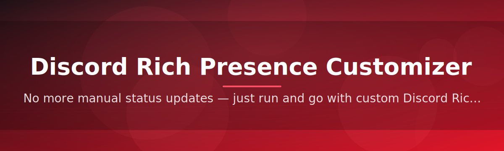
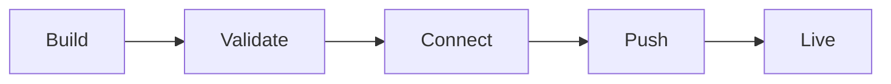

# discord-rich-presence-configurator 🎮✨

  

*Turn your Discord status into a tiny billboard for whatever you're actually doing — no code, no fuss, just vibes.*

---

## What this is NOT

This is **not** a bot you invite to a server, it's **not** a web dashboard that phones home with your data, and it's **not** some abandoned semester project that got dumped on GitHub and forgotten. There's no ad-laden Electron shell pretending to be lightweight, no forced account linking beyond what Discord itself requires, and no mystery background service quietly draining your battery.

What it **actually** is: a focused, standalone Windows utility that lets you design, preview, and swap Rich Presence states for your Discord profile — the little "Playing: Late Night Debugging Session" line under your name — through a clean interface instead of hand-editing JSON payloads and praying to the Developer Portal gods.

## 🧭 Overview

The Discord Rich Presence Customizer was born out of a very specific itch: Discord's built-in Rich Presence system is genuinely powerful, but actually *using* it means wiring up an application ID, writing a small client, managing asset keys, and re-deploying every time you want to change a detail string. That's a lot of ceremony for something that's supposed to be fun and expressive. This tool collapses all of that into a single desktop app where you type your status text, pick your images, set your buttons, and hit apply.

It exists for streamers who want their presence to match their scene, for developers who want their "coding" status to actually reflect what repo they're in, for music fans who want richer now-playing details than the default integrations offer, and honestly for anyone who just enjoys a well-crafted profile. The Discord Rich Presence Customizer isn't trying to replace Discord's official integrations — it's trying to be the missing configuration layer that makes custom presence data approachable for people who don't want to touch an SDK.

Under the hood it still respects Discord's real Rich Presence protocol — nothing here is a workaround or a spoof of the client, it's a friendlier front door to a legitimate feature. Every status you build is a real Rich Presence payload, rendered exactly how your friends will see it, previewed before it ever goes live.

  

---

## 🔥 What Makes This Thing Tick

- **Live preview panel** — see your status render exactly as it will appear in Discord's profile card before you commit to anything, so you're never guessing what "small image key" actually looks like at runtime.

- **Template presets** — jump-start your setup with ready-made layouts for gaming, coding, music, streaming, and "just vibing" statuses, then tweak them instead of starting from a blank canvas.

- **Multi-profile slots** — save several complete presence configurations and flip between them in one click, perfect for switching between "working," "gaming," and "afk but pretending" personas.

- **Asset key manager** — organize your uploaded image keys in one tidy list instead of digging through the Developer Portal every time you forget which key maps to which icon.

- **Button link builder** — attach up to two clickable buttons to your presence (portfolio, stream, repo, whatever) with validation so you don't ship a dead link.

- **Timestamp modes** — toggle elapsed or countdown timers on your status without doing timestamp math in your head.

- **Auto-refresh scheduler** — rotate presence text on an interval so your status doesn't sit frozen for six hours while you're deep in a task.

- **Config export/import** — save your setup as a portable file and move it between machines, no cloud account required.

> [!TIP]
> Stack the timestamp mode with the auto-refresh scheduler if you want a presence that feels "alive" — rotating text plus a ticking clock reads a lot more polished than a static line.

## 🚀 Getting Yourself Set Up

<strong>Click to expand the full walkthrough</strong>

1. **Visit the landing page** using the download button above — that's the only place this project distributes builds from.

2. **Download the standalone executable.** No installer wizard, no bundled toolbars, no surprise second download.

3. **Run it.** Windows may show a SmartScreen prompt for unsigned apps the first time — click "More info" → "Run anyway" if you trust the source (you should verify the page you got it from!).

4. **Configure your first presence.** Pick a template, adjust the text, drop in your image keys, and hit Apply. Check Discord — your status updates instantly.

> [!NOTE]
> No account credentials are ever requested inside the app. The tool talks to Discord using the same local IPC mechanism the official client itself supports for Rich Presence integrations.

## 🖥️ System Requirements

| Requirement | Detail |
|---|---|
| OS | Windows 10 or Windows 11 (64-bit) |
| Discord | Desktop client installed and running |
| Dependencies | None — fully standalone executable |
| Disk space | Under 50 MB |
| Internet | Only needed to fetch uploaded image assets |

---

## ⚙️ How It Works

The whole pipeline is intentionally short — fewer moving parts means fewer things that can break your status mid-stream.

1. You build a presence configuration in the UI (text, images, buttons, timestamps).

2. The app validates the payload structure against Discord's Rich Presence schema.

3. It opens a local connection to your running Discord client.

4. The payload is pushed through, and Discord renders it on your profile in real time.

5. Any edit you make afterward simply re-runs this same loop, so changes feel instant instead of requiring a restart.

## 🧩 Troubleshooting Corner

<strong>My status isn't updating in Discord at all</strong>

Make sure the Discord desktop client is actually running before you hit Apply — the tool connects to a live client process, it can't launch Discord for you.

<strong>The image I uploaded isn't showing up</strong>

Image keys can take a minute or two to propagate after upload. If it's still missing after five minutes, double-check the key spelling in the asset manager — a typo there is the most common culprit.

<strong>Windows is blocking the app from running</strong>

That's standard SmartScreen behavior for smaller, unsigned indie tools — it's not a sign of anything malicious, just a lack of an expensive code-signing certificate. Click through if you trust the source.

<strong>Can I run two different presences at once?</strong>

Discord only displays one Rich Presence per account at a time, so switching profile slots replaces the active one rather than stacking them.

<strong>Does this work with the Discord browser version?</strong>

No — Rich Presence integration requires the desktop client's local IPC socket, which the browser version doesn't expose.

> [!WARNING]
> Editing raw config files by hand outside the app can produce a malformed payload that Discord silently rejects. Stick to the UI unless you really know the schema.

## 🎨 UI, Themes & Little Comforts

The interface leans dark by default because, let's be honest, that's what most of us are staring at Discord in anyway — but a light theme ships too.

<strong>Keyboard shortcuts</strong>

| Shortcut | Action |
|---|---|
| `Ctrl + S` | Save current profile |
| `Ctrl + N` | New presence profile |
| `Ctrl + Enter` | Apply presence immediately |
| `Ctrl + Tab` | Cycle between saved slots |
| `F5` | Refresh live preview |

- **Theme toggle** sits in the top-right corner and remembers your choice between sessions.

- **Compact mode** shrinks the window for people who want it tucked in a corner while they work.

- **Settings panel** covers startup behavior, refresh interval defaults, and preview rendering scale.

---

## 🤝 Contributing & Community

This started as a proud little weekend build, and it genuinely grew way past what I expected — that only happened because people kept showing up with ideas, bug reports, and pull requests. Issues and PRs are always welcome, whether it's a new template preset, a UI polish, or a troubleshooting tip you learned the hard way.

> [!IMPORTANT]
> Before opening a PR for a big feature, drop an issue first so we can talk through the approach — saves everyone rework.

If you build something cool with your Rich Presence setup using this tool, showing it off in Discussions genuinely makes my day.

## 📄 License

Released under the [MIT License](LICENSE), 2026. Do good things with it.

## ⚠️ Disclaimer

This project is an independent tool built by a fan of Discord's platform and is not affiliated with, endorsed by, or sponsored by Discord Inc. It interacts with Discord's own supported Rich Presence integration mechanism and does not modify Discord's client files or violate its terms of service. Use responsibly, and always download from the official landing page linked in this README.

---

  

